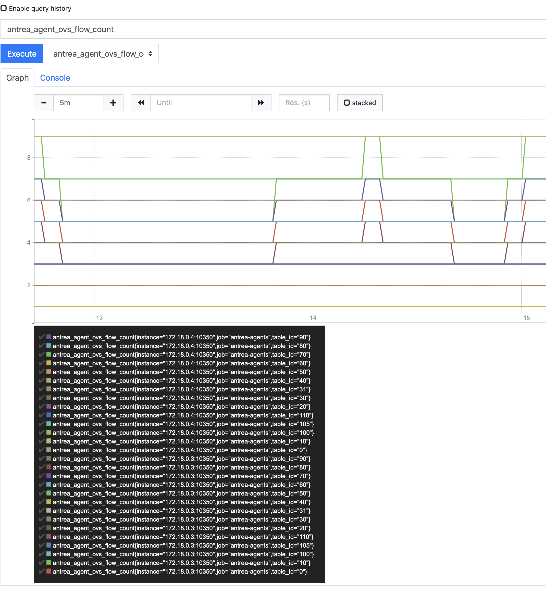

# Install prometheus metrics service in antrea 

Some advanced usage of antrea projects. 

Install antrea on kind using the recipe in this repo (../kind/kind-local-up.sh), disable 'calico' options and enable 'antrea' options
as shown in the README.

# Prometheus

```
	enable prometheus metrics in the configmap:		
	this must be done in BOTH places where you see enablePrometheusMetrics
```

Now

```
	kubectl apply -f build/yamls/antrea-prometheus.yml
```

then expose them:

```
	kubectl port-forward pod/prometheus-deployment-68b648df9c-28q6d --address 0.0.0.0 9090:9090 -n monitoring
```

now go to 

```
	http://localhost:9090/targets
```

You should see the targets running green.


Now, you can see how many flow table rules are in occurance... 




```
	ClassifierTable       binding.TableIDType = 0
	uplinkTable           binding.TableIDType = 5
	spoofGuardTable       binding.TableIDType = 10
	arpResponderTable     binding.TableIDType = 20
	serviceHairpinTable   binding.TableIDType = 29
	conntrackTable        binding.TableIDType = 30, conntrackStateTable   binding.TableIDType = 31
	sessionAffinityTable  binding.TableIDType = 40
	dnatTable             binding.TableIDType = 40
	serviceLBTable        binding.TableIDType = 41
	endpointDNATTable     binding.TableIDType = 42
	cnpEgressRuleTable    binding.TableIDType = 45
	EgressRuleTable       binding.TableIDType = 50, EgressDefaultTable    binding.TableIDType = 60
	l3ForwardingTable     binding.TableIDType = 70, l2ForwardingCalcTable binding.TableIDType = 80
	cnpIngressRuleTable   binding.TableIDType = 85, IngressRuleTable binding.TableIDType = 90
	IngressDefaultTable   binding.TableIDType = 100
	conntrackCommitTable  binding.TableIDType = 105
	hairpinSNATTable      binding.TableIDType = 106
	L2ForwardingOutTable  binding.TableIDType = 110
```

# Network Policies with antctl 

You can look at the antrea groups that are getting applied policies like so:
```
➜  bin git:(master) ✗ ./antctl-darwin get appliedtogroup
NAME                                 PODS
5c60b0d5-a914-5e1e-83fb-ebefed4e52d4 network-policy-7519/client-a-74gm8
➜  bin git:(master) ✗ ./antctl-darwin get appliedtogroup -o yaml
- name: 5c60b0d5-a914-5e1e-83fb-ebefed4e52d4
  pods:
  - pod:
      name: client-a-74gm8
      namespace: network-policy-7519
```
And specifically, you can see WHAT policy applies to this group...

```
➜  bin git:(master) ✗ ./antctl-darwin get networkpolicy -o yaml
- appliedToGroups:
  - 5c60b0d5-a914-5e1e-83fb-ebefed4e52d4
  name: allow-to-ns-b-server-a-via-namespace-selector
  namespace: network-policy-7519
  rules:
  - direction: Out
    from: {}
    services:
    - port: "53"
      protocol: UDP
    to:
      ipBlocks:
      - cidr: 0.0.0.0/0
  - direction: Out
    from: {}
    to:
      addressGroups:
      - 11f5cb9a-9b5f-5541-bf71-01a0f063369c
```


# ENCAP modes

There are multiple encap modes you can use

- encap (slower but will work in any network env)
- noEncap (faster but might not work across subnets)

Once you decide on the encap, you can use
- genev (better then vxlan, modern protocol more extensible)
- vxlan
- gre and stt (not sure about these)


