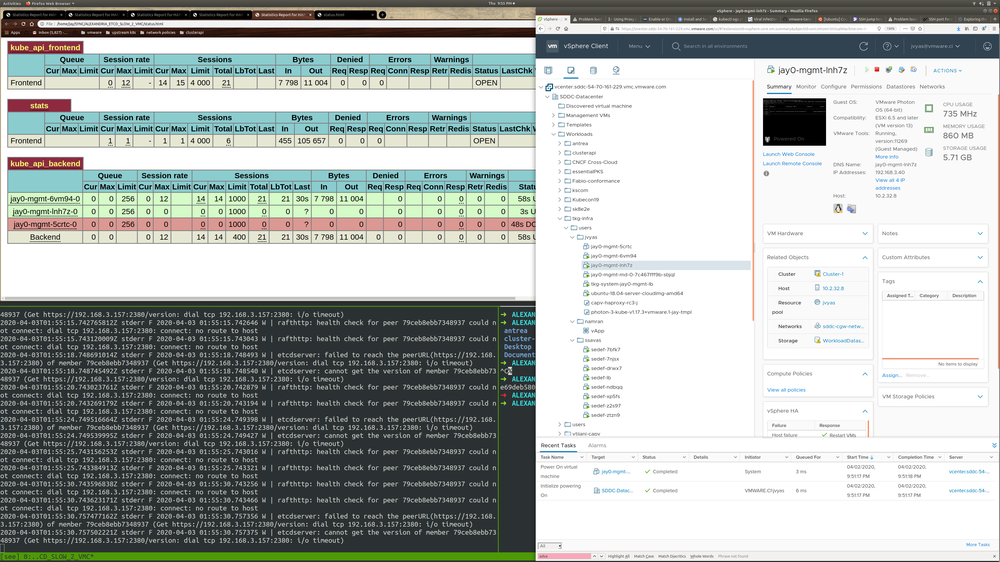

# What does a CAPV recovery scenario look like ? 

In CAPV HAProxy can be used to indicate the health of yourclusters.

Building off of what we know from how etcd operates in duress, lets consider some experiments

and see how the ClusterAPI responds... 

In a running 3 node CAPV cluster, deleting one etcd node wont cause writes to block.
But, deleting 2 nodes will.

- if ceil(n/2) nodes are dead. Your cluster will be down until capv recreates more machines.
- if < ceil(n/2) are dead, your cluster will self heal and leader elect
- if etcd is down on a node, the apiserver will also be down even if the quorum is still up.
- 

# using HAproxys dashboard to watch apiservers coming back up 

Since all CAPV clusters are accessed through HAProxy in VMware Tanzu production
Clusters , we can use this dashboard to monitor api server health and measure
Recovery times .

In a running CAPV cluster, we can delete a few nodes:


After doing this we just manually power machines on because all nodes are down.
This means CAPV can't do anything because it isn't alive anymore, until we restore 2/3 quorum:



Finally, we can manually power back on the 3rd node...


We also can just power off any node, and if there are enough nodes available for a write quorum,
CAPI will trigger turning that node back on.  When this happens, you'll see this in etcd's logs.

```
2020-04-03T02:34:21.35701956Z stderr F 2020-04-03 02:34:21.356912 W | etcdserver: cannot get the version of member 79ceb8ebb7348937 (Get https://192.168.3.157:2380/version: dial tcp 192.168.3.157:2380: connect: connection refused)
2020-04-03T02:34:23.2047401Z stderr F 2020-04-03 02:34:23.204581 I | rafthttp: peer 79ceb8ebb7348937 became active
2020-04-03T02:34:23.204787893Z stderr F 2020-04-03 02:34:23.204673 I | rafthttp: established a TCP streaming connection with peer 79ceb8ebb7348937 (stream Message reader)
2020-04-03T02:34:23.205015654Z stderr F 2020-04-03 02:34:23.204934 I | rafthttp: established a TCP streaming connection with peer 79ceb8ebb7348937 (stream MsgApp v2 reader)
```

# Capv will eventually self heal 

As long as one node in your master
Capv clusters is running, others
Can eventually self heal.


In these examples for speed I manually turned off VMs, but CAPv 
Did the hard work of noticing things were wrong and fixing them for
Me under the hood.

Note that turning on and off a machine as well as deleting a machine both are recoverable in the same way for CAPI clusters.
